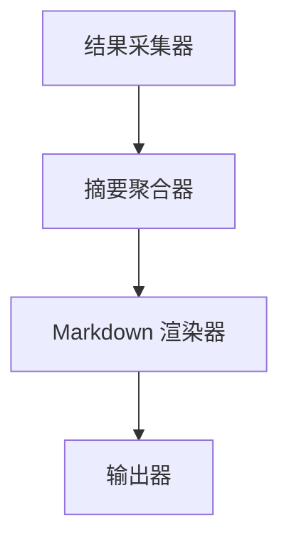
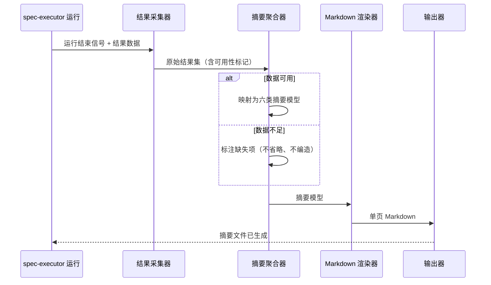

# 任务执行摘要 高层设计文档（HLD）

## 修订记录
| 版本 | 日期 | 作者 | 修订内容 | 依据/审批 |
| --- | --- | --- | --- | --- |
| v0.1 | 2026-07-01 | hld-design-agent | 基于 `outputs/PRD.md` 与功能简报创建初始 HLD，定义架构摘要、范围边界、架构视图、数据流、接口、ADR 与风险。 | [PRD-01][BIZ-01] |

## 文档概述
| 项目 | 内容 |
| --- | --- |
| 文档目的 | 支持"任务执行摘要"功能的架构对齐与实现交付决策，明确摘要的生成边界、数据流、模块职责与关键架构决策，供产品、工程、QA、运营对齐。 [PRD-01] |
| 目标读者 | 产品、工程、QA、运营，以及使用 spec-executor 的最终用户。 [PRD-01] |
| 系统边界 | spec-executor 运行结束后的一页 Markdown 摘要生成能力；不含 Web 面板、图表或非 Markdown 呈现形式。 [PRD-01] |
| 当前状态 | 草稿，等待评审。 [PRD-01] |
| 证据基础 | 上游 `outputs/PRD.md`（含 FR-001~FR-007、NFR-001~NFR-003、AC-001~AC-007）与 `briefs/feature-brief.md`。 [PRD-01][BIZ-01] |

## 背景与目标
spec-executor 在一次运行结束后会产生大量执行过程信息，用户当前缺少一份聚合的、面向人阅读的结果视图，需要自行翻阅日志才能判断本次运行是否成功、遇到了哪些关键事件以及后续应做什么。[PRD-01] 本功能的目标是在一次运行结束后自动生成一页 Markdown 摘要，覆盖目标、执行者、关键事件、验收结果、风险和下一步建议六类内容，让用户在一页内看懂运行结果（对应 PRD 目标 G-001），并降低用户判断运行结果的成本（对应 G-002）。[PRD-01]

本 HLD 以已完成的 `outputs/PRD.md` 为唯一上游需求来源，聚焦"如何在架构上产出这份摘要"，不重复 PRD 已定义的需求细节，也不下探至字段级实现（留给 LLD）。[PRD-01]

## 架构摘要
推荐采用**运行结束触发的单向数据管道（Pipeline）架构**：以 spec-executor 一次运行结束事件为触发点，从运行产生的结构化结果数据中**采集（Collect）→ 聚合（Aggregate）→ 渲染（Render）→ 落盘（Output）**，最终产出单个 Markdown 文档。核心设计原则如下：

- **只读上游、单向数据流**：摘要生成器只读取 spec-executor 运行结果数据，不回写、不修改运行过程，避免对既有执行链路产生副作用。[PRD-01]
- **诚实缺失（Honest Degradation）**：当某类数据不足时，摘要标注"缺失/不可用"而非省略或编造，保证完整性与可信度（对应 NFR-003）。[PRD-01]
- **渲染与数据分离**：聚合出的结构化"摘要模型"与 Markdown 渲染解耦，便于未来扩展其他呈现形式（当前范围外）。[PRD-01]
- **无状态、幂等**：同一份运行结果多次生成应得到一致摘要，便于重跑与验证。假设：运行结果数据在运行结束后可稳定读取。[PRD-01]

## 范围边界
| 类型 | 内容 | 说明 | 来源 |
| --- | --- | --- | --- |
| 范围内 | 一页 Markdown 摘要生成 | 运行结束后生成单个 Markdown 文档，覆盖六类要素 | [PRD-01] |
| 范围内 | 六类摘要内容 | 目标、执行者、关键事件、验收结果、风险、下一步建议 | [PRD-01] |
| 范围内 | 数据不足标注 | 数据不足时标注缺失项而非省略或编造 | [PRD-01] |
| 范围外 | 非 Markdown 呈现形式 | Web 面板、图表、其他导出格式本次不做 | [PRD-01] |
| 范围外 | 深度日志分析/诊断 | 摘要聚合结果，不替代完整日志与深度诊断 | [PRD-01] |
| 外部依赖 | spec-executor 运行结果数据 | 需提供目标、执行者、事件、验收等可读的结构化数据（DEP-001） | [PRD-01] |

## 干系人与关注点
| 干系人 | 关注点 | HLD 响应位置 |
| --- | --- | --- |
| spec-executor 用户 | 运行结束后快速判断成败与下一步 | 架构摘要、架构视图、数据与接口设计 |
| 运营/协作方 | 获取可传阅的统一结果记录 | 架构摘要、数据与接口设计 |
| 工程 | 数据流、模块边界、可扩展性 | 架构视图、数据与接口设计、架构决策与权衡 |
| QA | 六类内容完整性、数据不足行为可验证 | 质量属性目标、运维与可观测性、需求追踪矩阵 |
| 产品 | 触发方式、输出位置等开放问题的处置 | 约束假设依赖、风险与待确认事项 |

## 质量属性目标
| 质量属性 | 目标 | 度量方式 | 来源 |
| --- | --- | --- | --- |
| 可读性 | 摘要为 Markdown 且控制在一页篇幅内，面向人阅读 | 人工评审确认为 Markdown 且单页可读（NFR-001） | [PRD-01] |
| 完整性 | 覆盖六类必需内容 | 逐项检查六类内容均存在（NFR-002、MET-001） | [PRD-01] |
| 可靠性 | 数据不足时标注缺失而非省略或编造 | 构造数据不足场景检查缺失标注（NFR-003） | [PRD-01] |
| 一致性/幂等 | 同一运行结果多次生成结果一致 | 重复生成比对输出 | 假设：运行结果可稳定读取 |
| 生成成功率 | 运行结束后成功产出摘要 | 摘要生成成功率埋点（MET-002，阈值待产品确认） | [PRD-01] |

## 约束、假设与依赖
| 类型 | 内容 | 影响 | 来源 |
| --- | --- | --- | --- |
| 约束 | 摘要须为面向人阅读的单页 Markdown | 决定渲染目标与篇幅控制策略 | [PRD-01] |
| 约束 | 不修改 task package、不实现代码（本任务为设计交付） | 本 HLD 仅产出设计，不落地实现 | [BIZ-01] |
| 假设 | 摘要在运行结束后自动生成（触发方式待确认，OQ-001） | 若为手动触发则需调整触发边界 | [PRD-01] |
| 假设 | 运行结果数据在运行结束后可读且结构化 | 数据不可得则摘要退化为缺失说明 | [PRD-01] |
| 依赖 | spec-executor 提供目标/执行者/事件/验收等结构化数据（DEP-001） | 数据不可得则无法生成完整摘要 | [PRD-01] |

## 架构视图

### 上下文视图
摘要生成能力作为 spec-executor 运行生命周期的一个**运行后（post-run）只读消费者**存在。它以运行结束为输入信号，从运行结果数据源读取结构化数据，向 `outputs/` 写出一页 Markdown 摘要，供用户与协作方阅读。它不参与运行过程本身，不改变运行结果。[PRD-01]

### 容器/模块视图
摘要能力划分为四个高内聚、低耦合的模块，职责与边界如下：

| 模块 | 职责 | 输入 | 输出 | 边界说明 |
| --- | --- | --- | --- | --- |
| 结果采集器 Collector | 只读采集运行结果数据，识别六类要素的可用性 | 运行结果数据源 | 原始结果集 + 缺失标记 | 只读，不解释语义 |
| 摘要聚合器 Aggregator | 将原始结果映射为结构化"摘要模型"（六类字段），对缺失项打标 | 原始结果集 | 摘要模型 | 承载"诚实缺失"逻辑 |
| Markdown 渲染器 Renderer | 将摘要模型渲染为单页 Markdown，控制篇幅与版式 | 摘要模型 | Markdown 文本 | 与数据模型解耦 |
| 输出器 Output | 将 Markdown 落盘到约定输出位置 | Markdown 文本 | 摘要文件 | 输出位置待产品确认（OQ-001） |

### 运行时视图（数据流）
下图给出一次摘要生成的关键运行时数据流，包含数据不足的异常路径，对应 PRD 用户旅程：

数据流要点：全链路为单向流，采集器不解释语义、聚合器承载业务映射与缺失判定、渲染器只负责表达，三者职责不交叉，保证可测试性与可扩展性。[PRD-01]

### 部署视图
摘要能力随 spec-executor 运行环境就地执行，作为运行结束后的一个本地后处理步骤，无需独立服务或网络访问（本任务权限约束 network=false）。部署边界与 spec-executor 运行边界一致，随下一个功能版本发布；具体版本号待产品确认（属 PRD 开放问题）。[PRD-01]

## 数据与接口设计
| 对象/接口 | 所属方 | 契约 | 一致性/生命周期 | 来源 |
| --- | --- | --- | --- | --- |
| 运行结果数据源 | spec-executor | 提供目标、执行者、关键事件、验收结果等结构化字段（只读） | 运行结束后可读，生成期间视为不可变 | [PRD-01] |
| 摘要模型（内部） | 摘要聚合器 | 六类字段：目标、执行者、关键事件[]、验收结果、风险[]、下一步建议[]；每字段带"可用/缺失"状态 | 单次运行范围内，无跨运行状态 | [PRD-01] |
| Markdown 摘要文件 | 输出器 | 单个 Markdown 文档，含六类章节；缺失项以显式标注呈现 | 每次运行产出一份，输出位置待确认（OQ-001） | [PRD-01] |

摘要模型的六类字段与 PRD 功能需求一一对应：目标(FR-002)、执行者(FR-003)、关键事件(FR-004)、验收结果(FR-005)、风险(FR-006)、下一步建议(FR-007)，整体成文对应 FR-001。[PRD-01]

## 安全、隐私与合规设计
| 控制项 | 设计 | 验证方式 | 来源 |
| --- | --- | --- | --- |
| 数据访问 | 摘要能力对运行结果仅只读访问，不回写运行数据 | 代码审查确认无写路径 | [PRD-01] |
| 网络边界 | 生成过程不发起网络访问（本任务 network=false） | 权限配置与审查 | [BIZ-01] |
| 敏感信息 | 摘要面向人阅读，渲染时不得纳入运行环境注入类敏感变量 | 人工评审确认摘要不含敏感注入值 | 假设：需明确敏感字段清单 |

## 可靠性、性能与容量设计
| 主题 | 设计目标 | 方案 | 验证方式 | 来源 |
| --- | --- | --- | --- | --- |
| 可用性 | 运行结束后能稳定产出摘要 | 单向管道、无外部依赖、失败不影响运行主流程 | 摘要生成成功率（MET-002） | [PRD-01] |
| 降级 | 数据不足不导致失败 | 诚实缺失：缺失项标注后继续生成 | 数据不足场景测试（NFR-003） | [PRD-01] |
| 容量 | 单次运行单份摘要，篇幅约束为一页 | 内容按六类章节裁剪，控制单页可读 | 人工评审篇幅（NFR-001） | [PRD-01] |

摘要生成为轻量后处理，输入规模由单次运行结果决定，无并发放大；性能不构成架构风险，故不建立复杂容量模型。[PRD-01]

## 运维、可观测性与发布设计
| 项目 | 设计 | 负责人 | 来源 |
| --- | --- | --- | --- |
| 指标 | 采集摘要内容覆盖率(MET-001)与生成成功率(MET-002) | 负责人待定（OQ-002） | [PRD-01] |
| 日志 | 遵循 log-first 边界，记录生成开始/结束与缺失项，不额外抓屏 | 工程 | [BIZ-01] |
| 发布/回滚 | 按 PRD 分阶段：内部验证→全量发布；生成失败或内容缺失作为回滚条件 | 负责人待定 | [PRD-01] |

## 架构决策与权衡
| ID | 决策 | 背景 | 替代方案 | 理由 | 后果 | 状态 | 来源 |
| --- | --- | --- | --- | --- | --- | --- | --- |
| ADR-001 | 采用运行结束触发的单向数据管道（采集→聚合→渲染→输出） | 需在运行后聚合六类内容产出一页摘要 | 在运行过程中内联拼接摘要；事后批处理多次运行 | 单向管道职责清晰、只读无副作用、易测试与扩展 | 需依赖运行结束信号与结果数据可读（DEP-001） | 已接受 | [PRD-01] |
| ADR-002 | 渲染与数据模型分离（先聚合结构化摘要模型，再渲染 Markdown） | 当前只需 Markdown，未来可能扩展其他形式 | 直接由原始数据拼接 Markdown 字符串 | 解耦表达与数据，降低扩展成本，利于篇幅控制 | 引入一层摘要模型抽象，增加少量结构复杂度 | 已接受 | [PRD-01] |
| ADR-003 | 数据不足时采用诚实缺失标注而非省略或编造（对应 NFR-003） | 运行数据可能不完整（RISK-001） | 省略缺失章节；用占位文本填充 | 保证完整性与可信度，避免误导用户 | 缺失项呈现方式需与产品确认 | 待确认 | [PRD-01] |
| ADR-004 | 触发方式与输出位置暂按"运行结束自动生成、输出至 outputs"假设，待产品确认（OQ-001） | PRD 未定义触发方式与输出位置 | 手动触发；输出至日志目录或独立报告区 | 与简报"运行结束后提供"一致，作为最小合理默认 | 若产品另定则需调整触发与输出边界 | 待确认 | [PRD-01] |

## 风险、技术债与待确认事项
| 类型 | 内容 | 影响 | 缓解方式 | 负责人 | 状态 | 来源 |
| --- | --- | --- | --- | --- | --- | --- |
| 依赖 | 运行结果结构化数据不可得（DEP-001） | 摘要无法生成或大面积缺失 | 明确数据契约，缺失时诚实降级 | 待定 | 开放问题 | [PRD-01] |
| 风险 | 运行数据不足导致内容缺失（RISK-001） | 摘要价值下降 | ADR-003 诚实缺失标注 | 待定 | 待缓解 | [PRD-01] |
| 待确认 | 触发方式与输出位置未定义（OQ-001） | 影响触发与输出边界 | 产品确认后固化 ADR-004 | 产品 | 未确认 | [PRD-01] |
| 待确认 | 成功指标目标值与埋点负责人未定义（OQ-002） | 影响度量与运维 | 产品与工程确认埋点方案 | 产品 | 未确认 | [PRD-01] |
| 技术债 | 摘要模型抽象为未来扩展保留，当前仅服务 Markdown | 短期轻微冗余 | 待真实扩展需求出现再演进 | 工程 | 记录 | 假设 |

## 需求追踪矩阵
| PRD/来源 | 架构元素 | 质量目标 | 决策 | 验证方式 |
| --- | --- | --- | --- | --- |
| FR-001 [PRD-01] | 渲染器 + 输出器 | 可读性(NFR-001) | ADR-001/ADR-002 | AC-001 人工评审 |
| FR-002 [PRD-01] | 聚合器·目标字段 | 完整性(NFR-002) | ADR-001 | AC-002 内容检查 |
| FR-003 [PRD-01] | 聚合器·执行者字段 | 完整性(NFR-002) | ADR-001 | AC-003 内容检查 |
| FR-004 [PRD-01] | 聚合器·关键事件字段 | 完整性(NFR-002) | ADR-001 | AC-004 内容检查 |
| FR-005 [PRD-01] | 聚合器·验收结果字段 | 完整性(NFR-002) | ADR-001 | AC-005 内容检查 |
| FR-006 [PRD-01] | 聚合器·风险字段 | 完整性(NFR-002) | ADR-001 | AC-006 内容检查 |
| FR-007 [PRD-01] | 聚合器·下一步建议字段 | 完整性(NFR-002) | ADR-001 | AC-007 内容检查 |
| NFR-003 [PRD-01] | 采集器缺失标记 + 聚合器缺失判定 | 可靠性 | ADR-003 | 数据不足场景测试 |

## 参考文献
| 标记 | 来源 | 说明 |
| --- | --- | --- |
| [PRD-01] | `outputs/PRD.md` | 任务执行摘要 PRD，定义 FR-001~FR-007、NFR-001~NFR-003、AC-001~AC-007、目标 G-001/G-002 及开放问题。 |
| [BIZ-01] | `briefs/feature-brief.md` | 功能简报，定义"任务执行摘要"功能目标与六类必需内容。 |
| [M-HLD-01] | software-hld-writer / hld-output-contract | HLD 文档结构、证据与表达形式方法论（仅用于文档结构与质量标准）。 |
