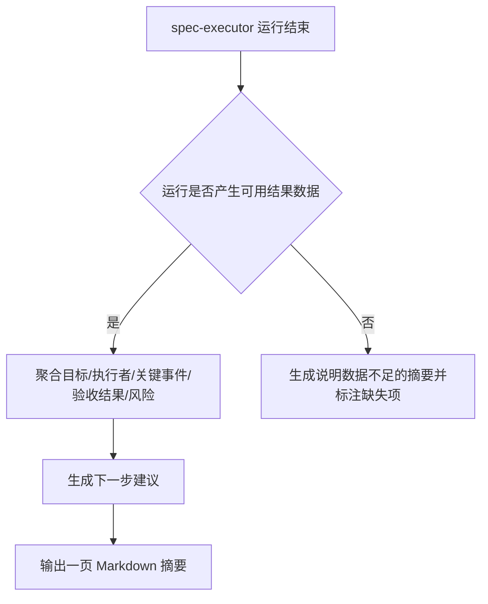

# 任务执行摘要 产品需求文档（PRD）

## 修订记录
| 版本 | 日期 | 作者 | 修订内容 | 依据/审批 |
| --- | --- | --- | --- | --- |
| v0.1 | 2026-07-01 | prd-design-agent | 基于功能简报创建初始 PRD，定义目标、范围、功能与非功能需求、验收标准。 | [BIZ-01] |

## 文档概述
| 项目 | 内容 |
| --- | --- |
| 文档目的 | 支持"任务执行摘要"功能的立项与实现交付决策，为产品、工程、QA 对齐交付范围与验收口径提供依据。 [BIZ-01] |
| 目标读者 | 产品、工程、QA、运营，以及使用 spec-executor 的最终用户。 [BIZ-01] |
| 适用版本 | 作为 spec-executor 运行结束后的新增摘要能力，随下一个功能版本发布；具体版本号待产品确认，属开放问题。 |
| 当前状态 | 草稿，等待评审。 [BIZ-01] |

## 背景与问题
spec-executor 在一次运行结束后会产生大量执行过程信息，但用户当前缺少一份聚合的、面向人阅读的结果视图，需要自行翻阅日志才能判断本次运行是否成功、遇到了哪些关键事件以及后续应做什么。功能简报明确要求为一次 spec-executor 运行结束后提供一页 Markdown 摘要，覆盖目标、执行者、关键事件、验收结果、风险和下一步建议。[BIZ-01] 该摘要用于降低用户理解运行结果的成本，是本 PRD 要解决的核心问题。当前痛点的量化证据（如平均排查耗时）暂无来源，作为开放问题记录。

## 目标与成功指标
| ID | 目标 | 指标定义 | 当前基线 | 目标值 | 来源 |
| --- | --- | --- | --- | --- | --- |
| G-001 | 让用户在一页内看懂一次运行结果 | 摘要在单个 Markdown 文档内覆盖目标、执行者、关键事件、验收结果、风险、下一步建议六类内容的比例 | 无（当前无摘要） | 六类内容全部覆盖 | [BIZ-01] |
| G-002 | 降低用户判断运行结果的成本 | 用户无需打开原始日志即可判断本次运行成败的比例 | 待度量，属开放问题 | 目标值待产品确认，属开放问题 | [BIZ-01] |

## 用户与使用场景
| 用户/角色 | 核心需求 | 典型场景 | 当前痛点 | 来源 |
| --- | --- | --- | --- | --- |
| spec-executor 用户 | 运行结束后快速了解结果 | 一次运行结束，用户打开摘要查看目标是否达成、验收是否通过 | 需自行翻阅日志判断结果 | [BIZ-01] |
| 运营/协作方 | 获取可传阅的结果记录 | 将摘要作为交接或复盘材料分享给团队 | 缺少统一的结果视图 | [BIZ-01] |

## 范围定义
| 类型 | 内容 | 说明 | 来源 |
| --- | --- | --- | --- |
| 范围内 | 一页 Markdown 摘要 | 在一次 spec-executor 运行结束后生成，内容覆盖六类要素 | [BIZ-01] |
| 范围内 | 六类摘要内容 | 目标、执行者、关键事件、验收结果、风险、下一步建议 | [BIZ-01] |
| 范围外 | 非 Markdown 的其他呈现形式 | 简报未要求 Web 面板、图表或导出格式，本次不做 | 假设：如需其他形式将另立需求 |
| 范围外 | 摘要之外的日志分析能力 | 摘要聚合结果，不替代完整日志与深度诊断 | 假设：深度诊断沿用现有日志能力 |
| 假设 | 摘要在运行结束后自动生成 | 简报描述"运行结束后……提供"，据此假设为运行结束触发；触发方式待确认 | [BIZ-01] |
| 约束 | 摘要须为面向人阅读的 Markdown | 简报明确要求 Markdown 一页摘要 | [BIZ-01] |

## 用户旅程与核心流程

## 功能需求
| ID | 优先级 | 需求 | 说明 | 来源 | 验收标准 |
| --- | --- | --- | --- | --- | --- |
| FR-001 | P0 | 在一次 spec-executor 运行结束后生成一页 Markdown 摘要 | 摘要为单个 Markdown 文档，面向人阅读 | [BIZ-01] | AC-001 |
| FR-002 | P0 | 摘要包含本次运行的目标 | 说明本次运行要达成的目标 | [BIZ-01] | AC-002 |
| FR-003 | P0 | 摘要包含执行者信息 | 标明本次运行的执行者 | [BIZ-01] | AC-003 |
| FR-004 | P0 | 摘要包含关键事件 | 列出运行过程中的关键事件 | [BIZ-01] | AC-004 |
| FR-005 | P0 | 摘要包含验收结果 | 呈现本次运行的验收通过或失败结论 | [BIZ-01] | AC-005 |
| FR-006 | P1 | 摘要包含风险 | 列出本次运行相关的风险 | [BIZ-01] | AC-006 |
| FR-007 | P1 | 摘要包含下一步建议 | 给出后续应采取的行动建议 | [BIZ-01] | AC-007 |

## 非功能需求与约束
| ID | 类别 | 要求 | 验证方式 | 来源 |
| --- | --- | --- | --- | --- |
| NFR-001 | 可读性 | 摘要须为 Markdown 且控制在一页篇幅内，面向人阅读 | 人工评审确认为 Markdown 且单页可读 | [BIZ-01] |
| NFR-002 | 完整性 | 摘要须覆盖目标、执行者、关键事件、验收结果、风险、下一步建议六类内容 | 逐项检查六类内容均存在 | [BIZ-01] |
| NFR-003 | 可靠性 | 当运行数据不足时，摘要须标注缺失项而非省略或编造 | 构造数据不足场景，检查摘要标注缺失 | 假设：需与产品确认缺失项呈现方式 |

## 数据、埋点与度量方案
| ID | 事件/指标 | 定义 | 属性/维度 | 看板/负责人 | 决策阈值 | 来源 |
| --- | --- | --- | --- | --- | --- | --- |
| MET-001 | 摘要内容覆盖率 | 摘要覆盖六类必需内容的比例 | 内容类别 | 负责人待定，属开放问题 | 六类全覆盖 | [BIZ-01] |
| MET-002 | 摘要生成成功率 | 运行结束后成功产出摘要的比例 | 运行结果状态 | 负责人待定，属开放问题 | 阈值待产品确认，属开放问题 | 假设：埋点方案需产品与工程确认 |

## 验收标准
| ID | 对应需求 | 验收标准 | 验证方式 | 来源 |
| --- | --- | --- | --- | --- |
| AC-001 | FR-001 | Given 一次 spec-executor 运行结束, When 生成摘要, Then 得到一份单页 Markdown 文档。 | 人工评审 | [BIZ-01] |
| AC-002 | FR-002 | Given 摘要已生成, When 查看内容, Then 必须包含本次运行的目标。 | 内容检查 | [BIZ-01] |
| AC-003 | FR-003 | Given 摘要已生成, When 查看内容, Then 必须包含执行者信息。 | 内容检查 | [BIZ-01] |
| AC-004 | FR-004 | Given 摘要已生成, When 查看内容, Then 必须包含关键事件列表。 | 内容检查 | [BIZ-01] |
| AC-005 | FR-005 | Given 摘要已生成, When 查看内容, Then 必须包含验收结果结论。 | 内容检查 | [BIZ-01] |
| AC-006 | FR-006 | Given 摘要已生成, When 查看内容, Then 必须包含风险项。 | 内容检查 | [BIZ-01] |
| AC-007 | FR-007 | Given 摘要已生成, When 查看内容, Then 必须包含下一步建议。 | 内容检查 | [BIZ-01] |

## 发布、灰度与回滚
| 阶段 | 范围 | 进入条件 | 监控项 | 回滚条件 | 负责人 |
| --- | --- | --- | --- | --- | --- |
| 内部验证 | 少量内部运行 | 摘要能覆盖六类内容 | 摘要生成成功率与内容覆盖率 | 摘要生成失败或内容缺失 | 负责人待定，属开放问题 [BIZ-01] |
| 全量发布 | 全部运行 | 内部验证通过 | 摘要生成成功率 | 生成成功率明显下降 | 负责人待定，属开放问题 [BIZ-01] |

## 依赖、风险与开放问题
| 类型 | ID | 内容 | 影响 | 负责人 | 截止日期 | 状态 | 来源 |
| --- | --- | --- | --- | --- | --- | --- | --- |
| 依赖 | DEP-001 | 依赖 spec-executor 运行结束后可提供目标、执行者、事件、验收等结构化数据 | 数据不可得则摘要无法生成 | 待定 | 待定 | 开放问题 | 假设：运行结果数据可读 |
| 风险 | RISK-001 | 运行数据不足导致摘要内容缺失 | 摘要价值下降 | 待定 | 待定 | 待缓解 | 假设：需定义缺失项处理 |
| 开放问题 | OQ-001 | 摘要的触发方式与输出位置未定义 | 影响实现方案 | 产品 | 待定 | 未确认 | 假设：需产品确认 |
| 开放问题 | OQ-002 | 成功指标目标值与埋点负责人未定义 | 影响度量方案 | 产品 | 待定 | 未确认 | 假设：需产品确认 |

## 需求追踪矩阵
| 来源 | 目标 | 需求 | 验收标准 | 指标 | 状态 |
| --- | --- | --- | --- | --- | --- |
| [BIZ-01] | G-001 | FR-001 | AC-001 | MET-001 | 待评审 |
| [BIZ-01] | G-001 | FR-002 | AC-002 | MET-001 | 待评审 |
| [BIZ-01] | G-001 | FR-003 | AC-003 | MET-001 | 待评审 |
| [BIZ-01] | G-001 | FR-004 | AC-004 | MET-001 | 待评审 |
| [BIZ-01] | G-001 | FR-005 | AC-005 | MET-001 | 待评审 |
| [BIZ-01] | G-002 | FR-006 | AC-006 | MET-002 | 待评审 |
| [BIZ-01] | G-002 | FR-007 | AC-007 | MET-002 | 待评审 |

## 参考文献
| 标记 | 来源 | 说明 |
| --- | --- | --- |
| [BIZ-01] | briefs/feature-brief.md | 功能简报，定义"任务执行摘要"功能的目标与六类必需内容。 |
